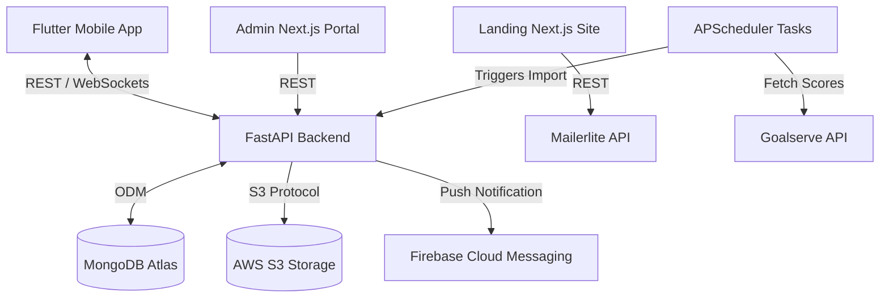

# 📘 Mon5majeur — Project & Architecture Description

This document provides a deep dive into the design, features, system architecture, database schemas, and API design of the **Mon5majeur** fantasy sports ecosystem.

---

## 1. Product Overview & Core Features

**Mon5majeur** is a fantasy sports application centered around basketball. It allows users to manage a virtual roster of real-world professional basketball players. Performance is calculated based on their real-world game statistics during live matchdays.

### Key Functional Features:
1. **User Authentication & Profiles**:
   - Secure authentication via email with One-Time Password (OTP) verification.
   - Social login via **Google OAuth** and **Apple Sign-in**.
   - Profile customizability (nicknames, avatar uploads, selected team logos, password updates).
2. **Leagues System**:
   - **Public Leagues**: Automatically grouped competitive rooms open to all users.
   - **Private Leagues**: User-created leagues with secure passcode invitations, waiting rooms, administrator management (kick members, trigger league start).
   - **Playoff Systems**: Support for match-day fixtures, bracket creation, and playoff series.
3. **Lineups & Selection (Starting Five)**:
   - Players must select exactly 5 starters matching basketball position guidelines.
   - Submissions are locked prior to real-world game times.
   - Budget constraint calculations (e.g. salary limits/credit costs per player).
4. **Token Economy & Shop (Bonuses)**:
   - Dedicated `TokenWallet` for in-app currencies.
   - Shop modules where users can buy tokens and spend them on attribute booster cards or team modifiers.
   - Quota systems tracking active bonuses (`UserBonusQuota`).
5. **Real-time Live Syncing**:
   - Live updates of game outcomes and stats synced from the external **Goalserve Sports API**.
   - Real-time score distribution to clients via WebSocket connections.
6. **FCM Push Notifications**:
   - Firebase Cloud Messaging integration alerting users of pending drafts, matchday stats, league invites, and status updates.

---

## 2. Technical Stack

| Component | Framework / Technology | Purpose |
| :--- | :--- | :--- |
| **Backend API** | FastAPI (Python 3.12) | Asynchronous core service, REST routes, WebSockets |
| **Database** | MongoDB + Beanie ODM | Dynamic, document-based storage with state management |
| **Real-time Engine** | FastAPI WebSockets | Bidirectional streaming of live scores to active clients |
| **Background Tasks** | APScheduler | CRON engines for Goalserve imports and automated playoff updates |
| **File Storage** | AWS S3 / local directory | Uploaded user profile avatars and league images |
| **Admin Web Portal** | Next.js (TypeScript) | Admin panel for configuration and player monitoring |
| **Landing Page** | Next.js (JavaScript) | Marketing, product overview, and Mailerlite subscription capture |
| **Mobile Client** | Flutter (Dart) | Cross-platform Android & iOS app with premium UI animations |

---

## 3. Database Architecture (MongoDB Beanie Models)

The backend utilizes **Beanie ODM** over **Motor** (Async MongoDB Driver). Below is the definition and relationship of core documents:

### Core Collection Models:

#### 1. `User`
Tracks authentication credentials, profile metadata, roles, and device registration tokens for push notifications.
* **Fields**: `email`, `hashed_password`, `first_name`, `last_name`, `avatar_url`, `is_active`, `is_verified`, `role_id`, `fcm_tokens`, `apple_id`, `google_id`, `created_at`, `updated_at`.

#### 2. `Role` & `Permission`
Role-Based Access Control (RBAC) supporting standard users, managers, and administrators.
* **Fields**: `name`, `code`, `permissions`.

#### 3. `Player`
Tracks professional basketball athletes, real-world team info, positions, credits/cost, and average ratings.
* **Fields**: `goalserve_id`, `name`, `position`, `team_name`, `credit_value`, `is_active`, `stats_summary`.

#### 4. `PlayerGameStats`
Captures single-game statistics (points, assists, rebounds, steals, blocks, turnovers) for a player to calculate their fantasy points.
* **Fields**: `player_id`, `game_id`, `points`, `rebounds`, `assists`, `steals`, `blocks`, `turnovers`, `fantasy_points_earned`.

#### 5. `League` & `LeagueMembership`
Defines competitive rooms and who participates inside them.
* **Fields**: `name`, `passcode`, `max_participants`, `is_private`, `is_started`, `creator_id`, `current_matchday`, `participants` (list of user IDs).

#### 6. `LeagueMatch`
Maps head-to-head encounters between fantasy teams inside a league.
* **Fields**: `league_id`, `matchday`, `home_team_id`, `away_team_id`, `home_score`, `away_score`, `status` (pending, playing, completed).

#### 7. `LineupSubmission`
The specific "Starting Five" players chosen by a user for a given matchday.
* **Fields**: `user_id`, `league_id`, `matchday`, `player_ids` (list of 5 IDs), `captain_id`, `booster_applied`, `total_fantasy_score`.

#### 8. `TokenWallet` & `TokenTransaction`
In-app tokens for buying enhancements.
* **Fields**: `user_id`, `balance`, `transactions` (type: debit/credit, amount, reason, timestamp).

---

## 4. System & API Architecture

### Key API Endpoints:

#### 🔐 Authentication & Profile (`/api/auth/` and `/api/UserProfiles/`)
* `POST /api/auth/register/` - Create a pending user account.
* `POST /api/auth/verify-otp/` - Confirm email registration using temporary OTP.
* `POST /api/auth/login/` - Generate JWT access and refresh tokens.
* `POST /api/auth/google/` - Google account validation and registration.
* `GET /api/UserProfiles/` - Retrieve active user profile data.
* `PUT /api/UserProfiles/{id}/` - Update user avatar, nickname, or settings.

#### 🏆 Leagues (`/api/private-leagues/` & `/api/public-leagues/`)
* `POST /api/private-leagues/` - Create a private league with passcode constraints.
* `POST /api/private-leagues/join/` - Join a private league via passcode validation.
* `GET /api/private-leagues/my_leagues/` - Retrieve leagues in which the active user participates.
* `POST /api/private-leagues/start_league/` - Lock entry and trigger league draft/matchday calendar generation.

#### 🏀 Roster & Matchdays (`/api/players-today/` & `/api/games-today/`)
* `GET /api/players-today/` - Retrieve players scheduled to play on the current matchday with credits.
* `POST /api/private-leagues/{id}/{matchday}/players-selection/` - Submit starting lineup.
* `GET /api/private-leagues/matches/{id}/{matchday}/` - Retrieve head-to-head match outcomes.

---

## 5. Deployment & Scalability Best Practices

1. **Environment Separation**:
   - Ensure `ENVIRONMENT` is set to `production` in live environments to disable OpenAPI debug documentation (`/docs`, `/redoc`) and auto-reload settings.
2. **CORS Hardening**:
   - `BACKEND_CORS_ORIGINS` should point strictly to the domain where the Admin Dashboard and Landing Page are hosted. Wildcard `*` origins must be avoided.
3. **Storage Security**:
   - Avatars and documents should upload directly to AWS S3 using AWS Signatures to avoid storing files locally inside ephemeral docker containers.
4. **WebSocket Connection Handling**:
   - WebSockets require stable gateway routers (like Nginx configured with `Upgrade` and `Connection` headers) to prevent connection drop-offs during game days.
